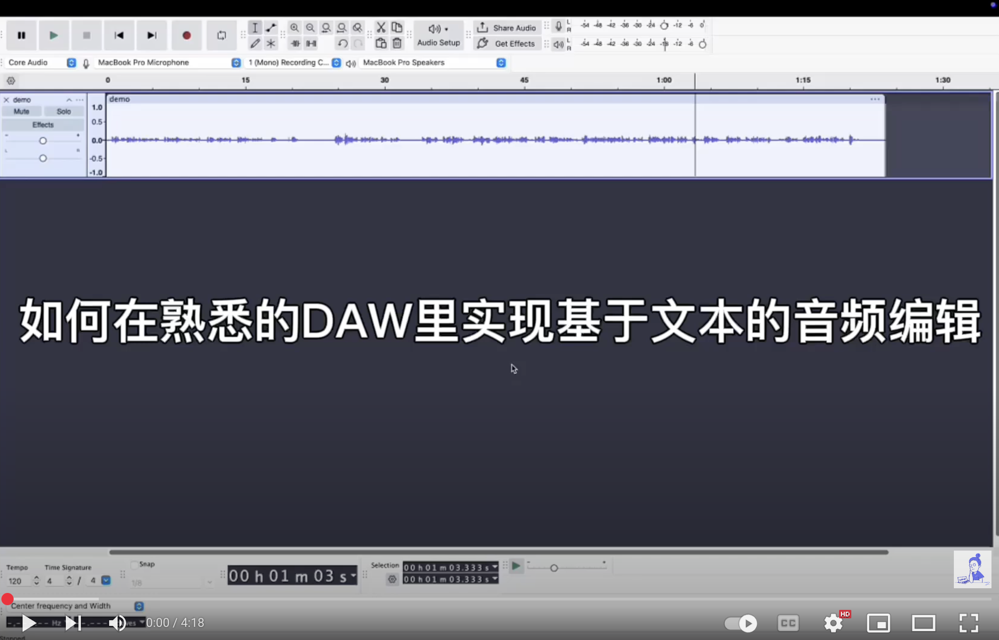

# audacity-whisper-labels

[This repository](https://github.com/gniquyij/audacity-whisper-labels) introduces a method for performing text-based audio editing in [Audacity](https://github.com/audacity/audacity). In brief, the steps are:

1. Set up your local environment. 
2. Run the script: it uses [whisper](https://github.com/openai/whisper) to transcribe the audio files and then converts the output .srt files into Audacity-compatible labels. 
3. Import the labels into Audacity. 

See more details in the video above. This method can also be adapted for other DAWs, such as Reaper, by updating the conversion section of the script.
